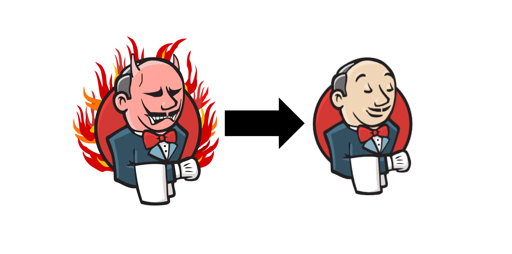

# Everything as a code with Jenkins

- Configuration as a code using JCasC plugin
- Pipeline as a code using Pipeline DSL plugin
- Jenkins jobs as code using Job DSL plugin

## TUTORIALS

- [How To Automate Jenkins Setup with Docker and Jenkins Configuration as Code](https://www.digitalocean.com/community/tutorials/how-to-automate-jenkins-setup-with-docker-and-jenkins-configuration-as-code)
- [How To Automate Jenkins Job Configuration Using Job DSL](https://www.digitalocean.com/community/tutorials/how-to-automate-jenkins-job-configuration-using-job-dsl)
- [Creating a Job DSL seed job with JCasC](https://gerg.dev/2020/06/creating-a-job-dsl-seed-job-with-jcasc/)
